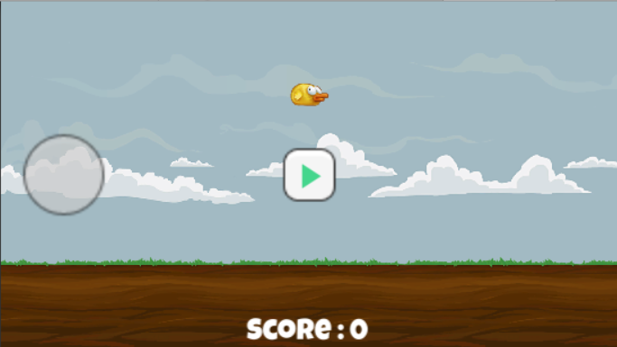
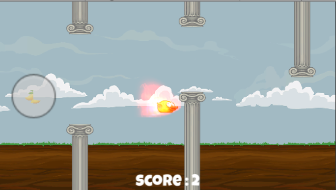
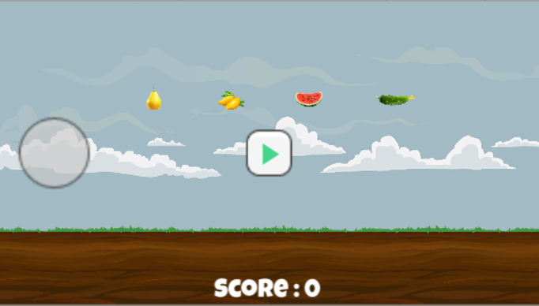
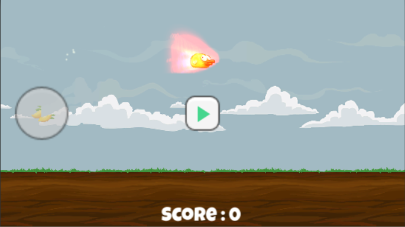
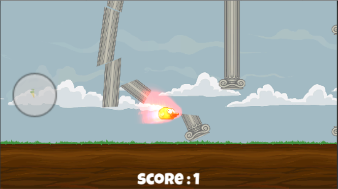

# FlappyBird-A beautiful world

#### Background

FlappyBird flapped and flapped, gradually, it feels tired……

With no more players that  are willing to flap him again, he is  so sad....

At this time, he entered a new world with delicious fruits!

He flapped and took one.Surprisingly, he gets <u>new skills</u>! Life becomes easier and he is no longer thirsty again.

He feels great to continue his journey!

#### How to Play?

Open ```builds```folder, choose ```exe``` or```apk``` for your platform.

Another choice is to download all the files and build it with your Unity.

#####  ==*Click to flap!*==

##### ==*Get fruits to survive longer!*==

#### Playing Pictures?



#### Fruits！New skills coming！



I provided 4 kinds of fruits. They have the following surprises from left to right:

- ***One More Score*** when passing a column.
- ***HeroMode!*** SpeedUp and break the columns forword!
- ***Be invisible.*** You can just pass through all the columns, viewing them as not existing!!!
- ***SmallerSize!*** Owning a smaller Size to easily passing through a column.

#### Skill Effect Preview





#### Note:

1. ***The Fruit has a lifetime which means if you don't take it in time , it will fade and disapper.***
2. ***All the skill effects will be removed when the label in the left circle fades.***
3. ***A friendly ticking time will remind you that skilltime is almost 0.***

#### Thanks:

- Unity Engine
- D 2D Destructible
- Resources from Unity Tutorial for flappyBird

### Hope you get fun from my game!